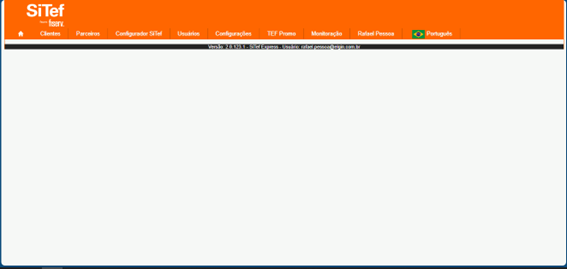
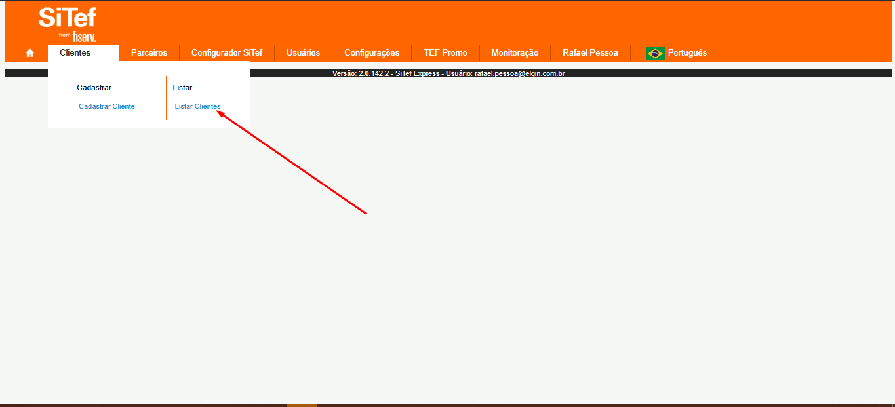
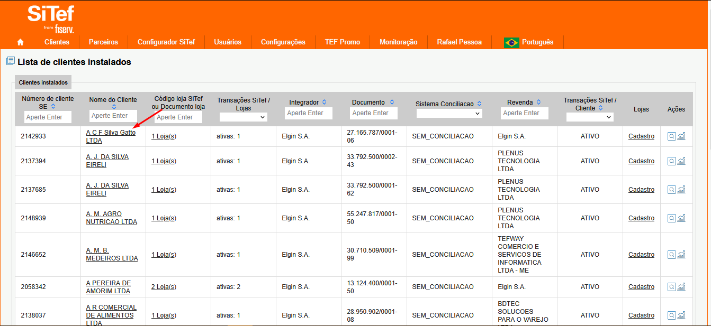
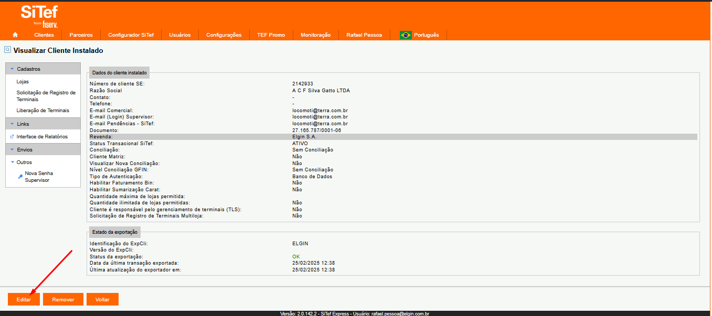
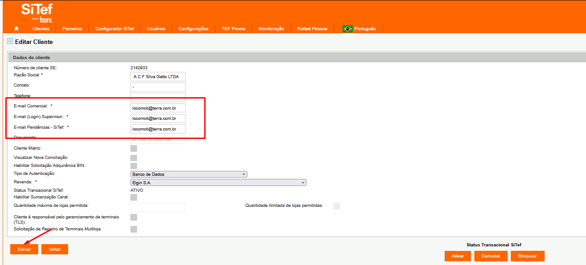
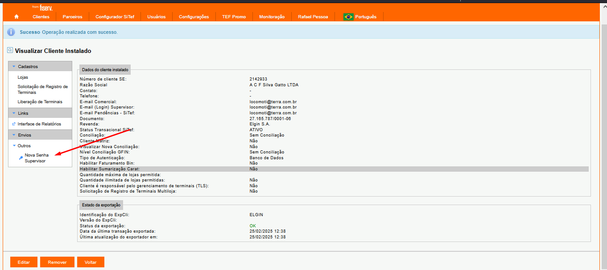

# Como resetar a senha do supervisor?

#### Segue abaixo o procedimento para resetar as credenciais de supervisor de uma loja:

#### 1.Acessar o módulo de integrador SITEF EXPRESS ADM, através do link: https://sitefexpressadm.softwareexpress.com.br/sitefwebadm.

##### 2.No menu clientes, selecionar a opção “Listar Clientes”:

##### 3. Clicar no nome do cliente::

##### 4. Clicar em editar:

##### 5. Clicar em salvar:

##### 6. Clicar em nova Senha de supervisor:

##### Assim que for realizado o procedimento supra, o cliente final receberá um e-mail para definir suas novas credenciais.
